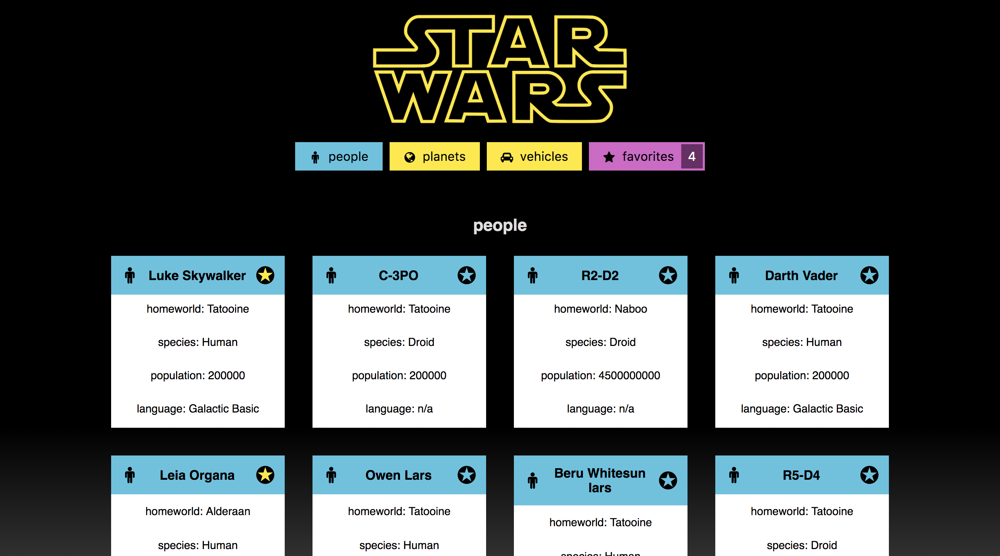

# Swapi Box aka Star Wars Cards

### [See this project live at katiescruggs.com/swapi-box](http://katiescruggs.com/swapi-box)

This was an individual project completed in a week as part of the front-end curriculum at the [Turing School](http://turing.io). The name Swapi-Box comes from the name for the Star Wars API: [swapi.co](http://swapi.co). Although I'm not the biggest fan of Star Wars, I had a lot of fun making this project. This was the first time I dealt with nested asynchronous API calls. For example, to get the residents of each planet, a person API call must be made for each one! It was also my first experience with mocking fetch calls in order to test them properly.

The goal of this project is to allow the user to favorite People, Planets, and Vehicles from the Star Wars world. Favorites persist in local storage on page refresh.

Technologies used: React, JavaScript, SCSS (including variables), asynchronous API calls, Promise handling
